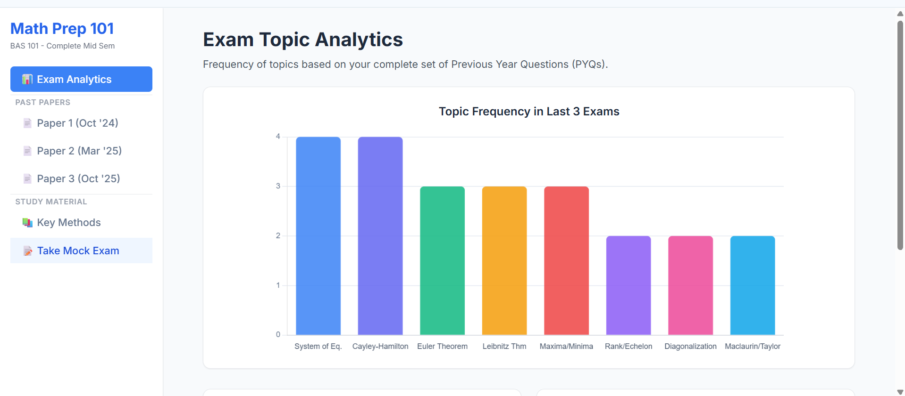

# 📊 Math Prep 101: BAS 101 Exam Dashboard

---

An interactive, high-utility study dashboard designed for **Applied Mathematics (BAS 101)** students at **IGDTUW**. This project streamlines midterm and end-term revision by combining data visualization with active recall strategies.

## 📸 App Preview

### 📊 Exam Analytics & Topic Frequency
Visualizes which topics appear most frequently in the last three years of IGDTUW papers.

### 📄 Interactive PYQs with Solutions
Toggleable step-by-step solutions for past paper questions (Linear Algebra & Calculus).

### 📚 Study Materials & Methods
Quick access to high-yield formulas like Euler's and Leibnitz Theorem.

### 📝 Predicted Mock Exam
A full-length practice paper designed based on current exam trends.

---
## 🚀 Features

* **Exam Topic Analytics:** Dynamic bar charts powered by **Chart.js** that visualize the frequency of topics across three years of PYQs (Oct '24, Mar '25, Oct '25).
* **Active Recall Solutions:** Hidden "Toggle Solution" blocks for over 30 questions to encourage self-testing before viewing the answer.
* **LaTeX Integration:** High-fidelity mathematical rendering using **MathJax** for complex Linear Algebra and Calculus proofs.
* **Predictive Mock Exam:** A full-length mock paper based on high-yield trends identified in recent exam cycles.
* **Responsive UI:** A clean, mobile-friendly dashboard built with **Tailwind CSS**.

## 🛠️ Tech Stack

* **Frontend:** HTML5, Tailwind CSS
* **Visualizations:** Chart.js
* **Math Rendering:** MathJax (LaTeX)
* **Deployment:** GitHub Pages

## 📂 Project Structure

* `index.html`: The core application containing the dashboard logic, styles, and question database.
* **Units Covered:** * **Unit 1:** Linear Algebra (Rank, Echelon form, Eigenvalues, Cayley-Hamilton Theorem).
    * **Unit 2:** Differential Calculus (Leibnitz Theorem, Euler's Theorem, Maxima/Minima).

## 👩‍💻 About the Developer

I am **Ananya Joshi**, a B.Tech student in **Computer Science and Artificial Intelligence** at **Indira Gandhi Delhi Technical University for Women (IGDTUW)**. I enjoy building tools that bridge the gap between complex data and user-friendly interfaces.

* **LinkedIn:** [ananya-joshi-cseai](https://www.linkedin.com/in/ananya-joshi-cseai/)
* **GitHub:** [@ananyajoshi-cseai](https://github.com/ananyajoshi-cseai)
* **Other Projects:** [After-Feel](https://github.com/ananyajoshi-cseai/after-feel) (AI Poetry Portfolio) and [CareerFlow AI](https://github.com/ananyajoshi-cseai/CareerFlow-AI).

## ⚖️ License

Distributed under the MIT License. See `LICENSE` for more information.
